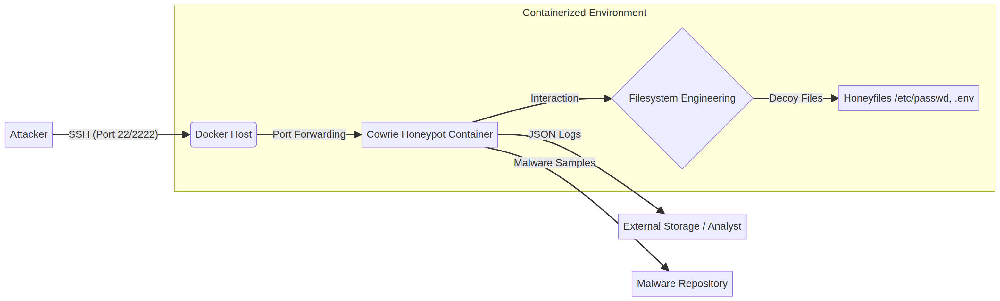
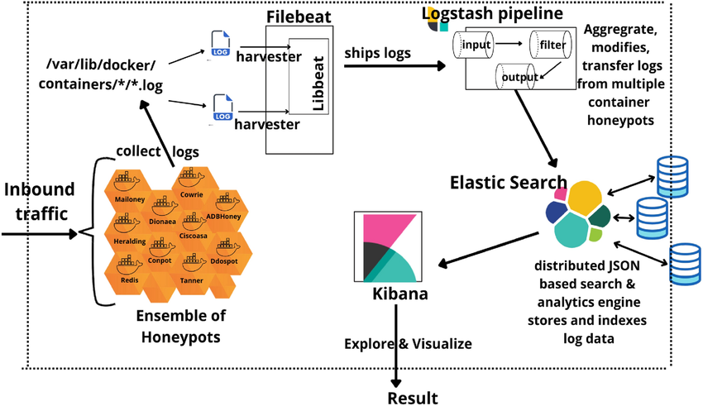
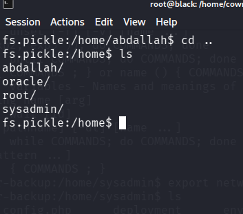
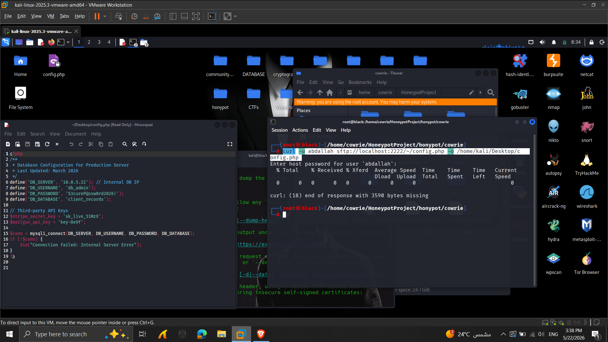
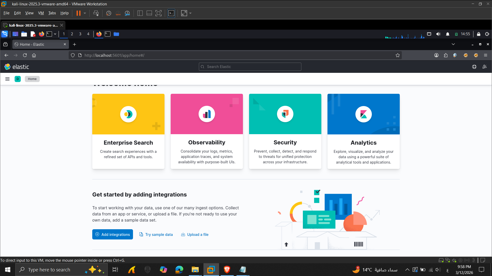

# Containerized Secure SSH Honeypot for Threat Intelligence

[](https://opensource.org/licenses/MIT)
[](https://www.docker.com/)
[](https://www.python.org/)

A high-fidelity SSH Honeypot (Cowrie) system engineered with a focus on **Deception Technology** and **Active Defense**. This project utilizes containerization to provide a secure, isolated, and highly realistic environment for capturing and analyzing attacker behavior to gather actionable threat intelligence.

---

## 🚀 Project Overview

This project implements a sophisticated decoy system designed to mimic a production Linux server. By meticulously crafting virtual filesystems and user personas, we maximize attacker "dwell time," allowing for the collection of deep insights into their methodologies without risking actual production assets.

## 🚀 Core Capabilities

### 🛡️ Advanced Deception Engineering
*   **Engineered Virtual Filesystem:** Custom-built Linux directory structure designed to mimic a high-value production server.
*   **Persona Customization:** Simulated user profiles and home environments to increase attacker dwell time and interaction.
*   **Decoy Assets:** Strategic placement of "Honeyfiles" and sensitive-looking credentials to lure deeper exploitation attempts.
*   **Immersive Shell Environment:** Authentic server banners and interactive shell responses for maximum high-interaction realism.

### 🐳 Hardened Containerized Infrastructure
*   **Docker-Native Deployment:** Seamless, multi-container orchestration for rapid scaling and complete environment isolation.
*   **Privilege Segregation:** Secure non-root execution within containers to prevent any potential host-system compromise.
*   **Ephemeral Architecture:** Lightweight and portable design, ensuring consistent and reproducible environments.
*   **Attack Surface Reduction:** Minimized container footprint to maintain a secure and stealthy observation post.

### 🔍 Comprehensive Threat Intelligence Pipeline
*   **Behavioral Monitoring:** Full session recording and real-time command logging for advanced TTP (Tactics, Techniques, and Procedures) analysis.
*   **Credential Harvesting:** Automated collection and categorization of brute-forced usernames and passwords.
*   **Payload Analysis:** Real-time monitoring and capturing of malicious file downloads and execution attempts.
*   **Geolocation & Attribution:** Advanced IP tracking and geographic mapping of global threat actors.

### 📊 Operational Observability (ELK Integration)
*   **Centralized Log Aggregation:** Scalable storage of all security events and interaction data using Elasticsearch.
*   **Automated Log Parsing:** Dynamic log processing via Logstash pipelines to transform raw data into structured intelligence.
*   **Interactive Visual Analytics:** Custom Kibana dashboards designed for real-time threat visualization and executive reporting.
*   **Actionable Insights:** Data-driven intelligence to identify trends and strengthen overall security posture.

---

## 🏗️ System Architecture

The system follows a modular architecture where incoming malicious traffic is isolated and analyzed in real-time.


*Figure 1: High-Level System Architecture & Traffic Flow*

### The ELK Data Pipeline
We utilize the ELK Stack (Elasticsearch, Logstash, Kibana) combined with Filebeat to transform raw attack logs into visual intelligence.


*Figure 2: Data Aggregation and Visualization Pipeline*

---

## 🛠️ Core Features & Engineering

### 1. Filesystem Engineering
We used `fsctl.py` to build a convincing directory structure that mimics a live production server, including common system paths and application-specific directories.


*Figure 3: Customized virtual filesystem showing realistic user home directories.*

### 2. Strategic Honeyfiles
Decoy files (e.g., `.env`, `config.php`, `backup.sql`) containing fake but realistic credentials are planted to lure attackers into revealing their specific objectives.


*Figure 4: Example of a planted honeyfile with fake API keys and DB credentials.*

### 3. Threat Visualization
All captured interactions are visualized through custom Kibana dashboards, allowing for immediate identification of attack patterns and originations.


*Figure 5: Real-time Threat Intelligence Dashboard.*

---

## 🚦 Getting Started

### Prerequisites
*   Docker & Docker Compose
*   Linux Environment (Recommended)

### Installation
1. **Clone the Repo:**
   ```bash
   git clone https://github.com/black1892004-cloud/Containerized-Secure-SSH-Honeypot-for-Threat-Intelligence.git
   cd Containerized-Secure-SSH-Honeypot-for-Threat-Intelligence
   ```

2. **Deploy with Docker Compose:**
   ```bash
   docker-compose up --build -d
   ```

3. **Verify Deployment:**
   ```bash
   docker ps
   ```

---

## 🛡️ Security & Isolation
*   **Non-Root Execution**: Cowrie runs as a non-privileged user inside the container.
*   **Network Isolation**: Docker bridge networking restricts the honeypot's visibility of the host network.
*   **Stateless Operation**: Container restarts revert any unauthorized changes made by attackers.

---

## 📈 Future Enhancements & Roadmap

### 🤖 AI-Driven Threat Analysis
*   **Anomaly Detection:** Integrating Machine Learning models to automatically distinguish between automated bot scripts and human-driven targeted attacks.
*   **Automated Threat Scoring:** Implementing an AI engine to rank attackers based on their sophistication and the risk they pose to real systems.

### 🕸️ Honey-Network Expansion
*   **Multi-Protocol Support:** Expanding the honeypot to support additional protocols such as RDP, Telnet, and HTTP to capture a wider range of attack vectors.
*   **Distributed Sensor Network:** Deploying multiple honeypot nodes across different geographic regions to build a global threat map.

### 🛡️ Active Defense & Response
*   **Dynamic Deception:** Implementing a system that changes the virtual environment in real-time based on the attacker's actions to keep them engaged longer.
*   **Automated Firewall Integration:** Automatically blacklisting high-risk IPs in real production firewalls based on intelligence gathered by the honeypot.

### 📊 Advanced SOC Integration
*   **SIEM Connector:** Developing native connectors for major SIEM platforms like Splunk and IBM QRadar for seamless enterprise integration.
*   **Incident Response Playbooks:** Creating automated playbooks that trigger specific investigation workflows when high-severity events are detected.

---
Project developed as a Graduation Thesis in Cybersecurity.
